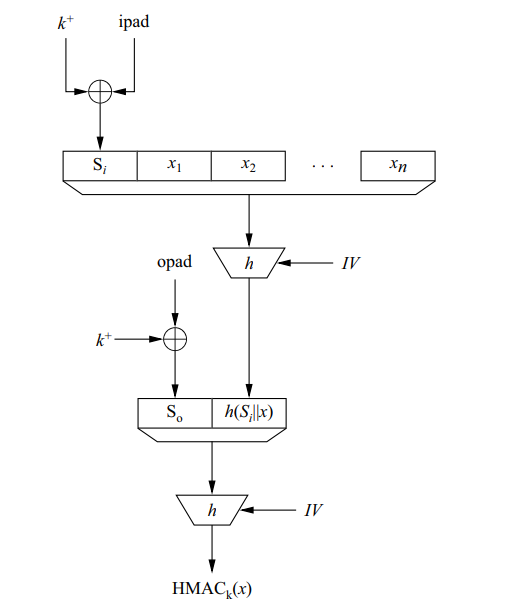

# Homework on Hashes (Due date Dec 5)

**10-Q2**
One of the earlier applications of cryptographic hash functions was the storage of passwords for user authentication in computer systems. With this method, a password is hashed after its input and is compared to the stored (hashed) reference password. People realized early that it is sufficient to only store the hashed versions of the passwords. 
1. Assume you are a hacker and you got access to the hashed password list. Of course, you would like to recover the passwords from the list in order to impersonate some of the users. Discuss which of the three attacks below allow this. Exactly describe the consequences of each of the attacks: 
- Attack A: You can break the one-way property of h. \
**A: Breaking one-way property** means making a way to find the password based on hash, which completely hacks hashing allowing to generate all the passwords based on stored hashes.

- Attack B: You can find second preimages for h. \
**A: You can break through specific hash having that preimage**, but it is not helping hack another hash or restore hash function or restore original credentials. Allow to use specific credentials for the hacked hash, if there are no secondray authentication methods.

- Attack C: You can find collisions for h. \
**A: The same as previous. If 2 identical hashes found for different inputs, you can break through specific hash if it is in the database**, but cannot restore the hash function based on that information, and in case of secondray authentication methods cannot go further.

2. Why is this technique of storing hashed passwords often extended by the use of a so-called salt? (A salt is a random value appended to the password before hashing. Together with the hash, the value of the salt is stored in the list of hashed passwords.) Are the attacks above affected by this technique? \
**A:** A salt is a random value appended to the password before hashing. It makes mass brute-force attacks on passwords computationally expensive. Precomputed hashes for commonly used passwords cannot be used as well as attack cannot rely on the shared of commonly-used passwords between multiple credentials.

3. Is a hash function with an output length of 80 bit sufficient for this application? \
**A:** No, it is too small, for modern computers it is required at least 2^{80} operations, but having length of 80, it actually requires only $sqrt(2^{80}) = 2^{40}$ operations (birthday paradox) for preimage attacks which is a small for modern hardware. Good practice requires at least 256-bit hash.

**10-Q3**
We consider three different hash functions which produce outputs of lengths 64, 128 and 160 bit. After how many random inputs do we have a probability of $\epsilon = 0.5$ for a collision? After how many random inputs do we have a probability of $\epsilon = 0.1$ for a collision? \
**A:** baseon on formula from the book $$t=2^{0.5(n+1)}sqrt(ln(1/(1-\epsilon)))$$
- $n=64, \epsilon=0.5: t = 2^{32}$
- $n=64, \epsilon=0.1: t = 2^{30}$
- $n=128, \epsilon=0.5: t = 2^{64}$
- $n=128, \epsilon=0.1: t = 2^{62}$
- $n=160, \epsilon=0.5: t = 2^{80}$
- $n=160, \epsilon=0.1: t = 2^{78}$

**11-Q2.1-2.5**

A cryptographic hash function h(X) takes 8-bit blocks, outputs a 4-bit and works as
follows. The input to the algorithm is a number X in the range [0; 63] with binary (base
2) representation $X = (x_1x_2 . . . x_8)$. Let $X = Y_1Y_2$ where $Y_1$ and $Y_2$ are numbers in the range [0, 15] with binary (base 2) representations $Y_1 = (x_1x_2x_3x_4)$ and $Y_2 =(x_5x_6x_7x_8)$, respectively. The hash output is $Z = (z_1z_2z_3z_4)$ which is binary (base 2) representation of $Z = Y_1^2 + Y_2^2 + 7\ mod\ 15$.

1. Use the hash function to find the hash value of the message 1010, 1001, 0101, 10 using
MerkleDamgard construction. (1 mark)\
**A:**
* The message blocks as given `1010, 1001, 0101, 10` — 1st pad the last short block to 4 bits as `0010`. So the four 4-bit blocks are:
  - $B_1$ = `1010`, 
  - $B_2$ = `1001`, 
  - $B_3$ = `0101`,
  - $B_4$ = `0010`.
* Step 1: Start with initial zero vector: $Y_1 = IV = 0$ (`0000`), $Y_2 = B_1 = 10$ (`1010`)
  $Z_1 = 0^2 + 10^2 + 7 = 0 + 100 + 7 = 107 \equiv 2 \pmod{15}$ → $H_1 = $ `0010`.
* Step 2: $Y_1 = 2$ (`0010`), $Y_2 = B_2 = 9$ (`1001`)
  $Z_2 = 2^2 + 9^2 + 7 = 4 + 81 + 7 = 92 \equiv 2 \pmod{15}$ → $H_2 = $ `0010`.
* Step 3: $Y_1 = 2$, $Y_2 = B_3 = 5$ (`0101`)
  $Z_3 = 2^2 + 5^2 + 7 = 4 + 25 + 7 = 36 \equiv 6 \pmod{15}$ → $H_3 = $ `0110`.
* Step 4: $Y_1 = 6$ (`0110`), $Y_2 = B_4 = 2$ (`0010`)
  $Z_4 = 6^2 + 2^2 + 7 = 36 + 4 + 7 = 47 \equiv 2 \pmod{15}$ → $H_4 = $ `0010`.

**Merkle–Damgard hash = `0010`**

2. Suppose the first bit of the message $(x_1)$ is flipped. How many bits in the hash value
changes? Show step of deriving your answer.(1 mark) \
**A:**
Flipping $x_1$ flips the most significant bit of $B_1$ (`1010` → `0010`), so new blocks are:
$B_1' = $ `0010` (2), $B_2 = $ `1001` (9), $B_3 = $ `0101` (5), $B_4 = $ `0010` (2). \
Compute chained hash for this modified message (IV `0000`):
* Step 1': $Y_1=0$, $Y_2=2$ → $Z_1' = 0^2 + 2^2 + 7 = 11$ → $H_1' = $ `1011`.
* Step 2': $Y_1=11$, $Y_2=9$ → $Z_2' = 11^2 + 9^2 + 7 = 121 + 81 + 7 = 209 \equiv 14 \pmod{15}$ → $H_2' = $ `1110`.
* Step 3': $Y_1=14$, $Y_2=5$ → $Z_3' = 14^2 + 5^2 + 7 = 196 + 25 + 7 = 228 \equiv 3 \pmod{15}$ → $H_3' = $ `0011`.
* Step 4': $Y_1=3$, $Y_2=2$ → $Z_4' = 3^2 + 2^2 + 7 = 9 + 4 + 7 = 20 \equiv 5 \pmod{15}$ → $H_4' = $ `0101`. \
Original final hash: `0010`. New final hash: `0101`.
**3 bits changed**

3. The hash is used to construct MAC for the above message, assuming k = 1010. Use HMAC structure assuming opad = (0110) and ipad = (1001). (1 mark) \
**A:**
Use standard HMAC structure: $\text{HMAC}_k(m) = H((k \oplus \text{opad}) \| H((k \oplus \text{ipad}) \| m))$.

.

Here we treat $(k \oplus \text{ipad})$ as the first 4-bit block in the inner Merkle–Damgard processing.

* $k \oplus \text{ipad} = $ `1010` $\oplus$ `1001` $=$ `0011` (3).
* $k \oplus \text{opad} = $ `1010` $\oplus$ `0110` $=$ `1100` (12).

**Inner hash**: process blocks $[k\oplus\text{ipad}, B_1, B_2, B_3, B_4] = [$ `0011`, `1010`, `1001`, `0101`, `0010` $]$ starting from IV `0000`:

Compute stepwise ($Y_1 = $ previous H, $Y_2 = $ current block):

* Step 1: $Y_1 = 0$ (`0000`), $Y_2 = 3$ (`0011`) → $Z = 0^2 + 3^2 + 7 = 0 + 9 + 7 = 16 \equiv 1 \pmod{15}$ → $H = $ `0001`
* Step 2: $Y_1 = 1$ (`0001`), $Y_2 = 10$ (`1010`) → $Z = 1^2 + 10^2 + 7 = 1 + 100 + 7 = 108 \equiv 3 \pmod{15}$ → $H = $ `0011`
* Step 3: $Y_1 = 3$ (`0011`), $Y_2 = 9$ (`1001`) → $Z = 3^2 + 9^2 + 7 = 9 + 81 + 7 = 97 \equiv 7 \pmod{15}$ → $H = $ `0111`
* Step 4: $Y_1 = 7$ (`0111`), $Y_2 = 5$ (`0101`) → $Z = 7^2 + 5^2 + 7 = 49 + 25 + 7 = 81 \equiv 6 \pmod{15}$ → $H = $ `0110`
* Step 5: $Y_1 = 6$ (`0110`), $Y_2 = 2$ (`0010`) → $Z = 6^2 + 2^2 + 7 = 36 + 4 + 7 = 47 \equiv 2 \pmod{15}$ → $H = $ `0010`

Inner hash = `0010`

**Outer hash**: process blocks $[k\oplus\text{opad}, H_{\text{inner}}] = [$ `1100`, `0010` $]$ starting from IV `0000`:

Compute stepwise ($Y_1 = $ previous H, $Y_2 = $ current block):

* Step 1: $Y_1 = 0$ (`0000`), $Y_2 = 12$ (`1100`) → $Z = 0^2 + 12^2 + 7 = 0 + 144 + 7 = 151 \equiv 1 \pmod{15}$ → $H = $ `0001`
* Step 2: $Y_1 = 1$ (`0001`), $Y_2 = 2$ (`0010`) → $Z = 1^2 + 2^2 + 7 = 1 + 4 + 7 = 12 \equiv 12 \pmod{15}$ → $H = $ `1100`

**HMAC output = `1100`**

4. What is the success chance of the adversary in constructing a forged message that passes the verification test? Explain how this probability is calculated. (1 mark) \
**A:**
The MAC tag produced is a 4-bit value, but the hash function computes values $\bmod 15$, so the set of outputs is $\{0,\ldots,14\}$ — **15 distinct possible tags** (the value 15 never occurs).
If an attacker tries to forge a valid tag without the key, the best they can do (random guess) is to produce a tag that matches the legitimate tag. Assuming uniformity, the success probability is
$$ P = {1}/{15} \approx 0.0667 $$

5. Alice and Bob are using the above MAC for secure communication and would like to reduce the success chance of attacker by a factor of 2−8. Suggest one way of achieving this goal and estimate the new reduced success probability of the attacker. (1 mark) \
**A:**
Increase tag size to 8 bit
Modify hash function to have mod 251 (closest prime number to the 2^8) to fit all, so probability of forgery will become
$$P = {1}/{251} \approx 1/2^{8}$$

**11-Q3** \
A transportation company wants to store the account balance of its customers in an
encrypted form on a magnetic stripe card. When the customer uses the card, the reader
reads the balance from the card, authorizes the transaction if there is sufficient balance, and
updates the card with the new balance. Discuss and compare the security and practical
issues with the following methods for storing the account balance on the card. (1) store a
cryptographic hash of the account balance (2) store the ciphertext of the account balance
encrypted with the company’s public key using a public-key cryptosystem, (3) store the
account balance along with a tag created by a message authentication code (MAC) using the
secret key of the company (4) store a digitally signed version of the account balance using
the signing key of the company. Compare the different solutions. Consider your preferred
solution among them. Is it still possible to compromise the security? if so, how? (2 marks)

Considering that methonds from Confidentiality, Integrity and Authenticity cryptography aspects:

- (1) Hash cannot be used to store balance, since it is one-way encoding, balance cannot be decoded from the hash. Hash provides a way to check integrity, so can be used in combination with other methods (e.g. HMAC).

- (2) Public-key encryption protects confidentiality: attackers cannot read the balance, but it can be used for encryption. Attakers can encrypt any balance using the company’s public key if they hack the device or use custom magnetic card writer also attacker can be anybody knowing the public key, so it is not providing Integrity and Authenticity.

- (3) MAC uses a secret key known only by the company, attaker cannot forge or modify the balance because they cannot compute a valid MAC.
The reader must store the secret key to verify the MAC and generate a new one when updating the balance. If many readers exist and one is compromised, the attacker learns the secret key and can forge balances on any card.
Verdict: Strong and practical, but relies on secure storage of the shared secret key across all devices.

- (4) Digital signature uses the company’s signing private key.
Anyone (including the card reader) can verify the signature with the public key. (Authenticity is provided)
Customers cannot forge balances because they do not have the private key. (Integrity is provided) Readers only need the public key to verify, so compromising a reader does not reveal the signing key, but to update the balance, the reader must generate a new signature → meaning it must store the private signing key. If readers hold the private key, compromising a reader exposes it, allowing unlimited forgery. Secure only if updates are done by a central server holding the private key. Not secure if offline readers must sign locally.

